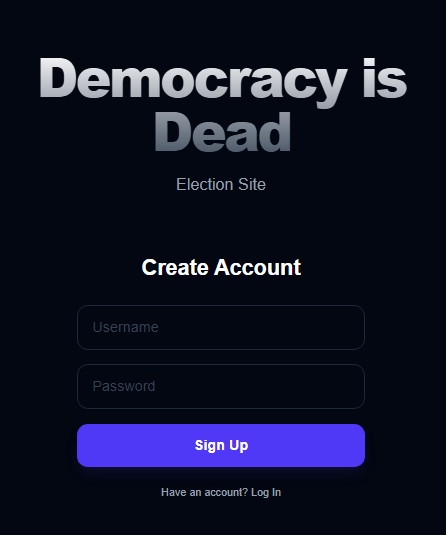
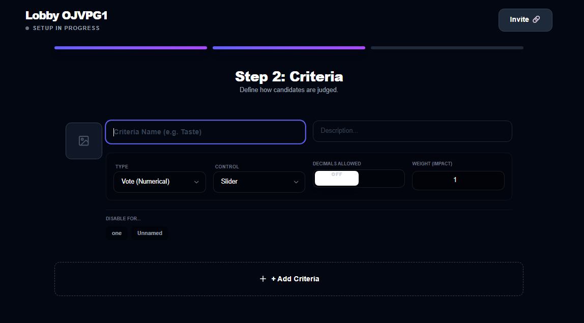
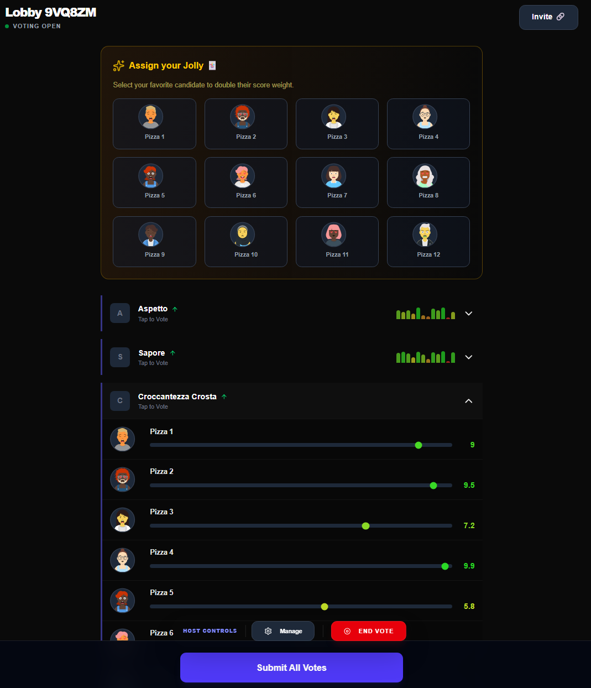
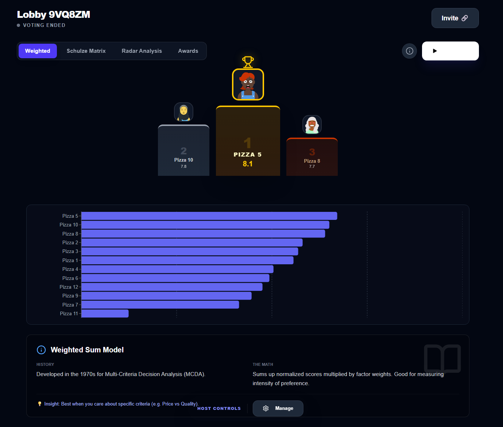
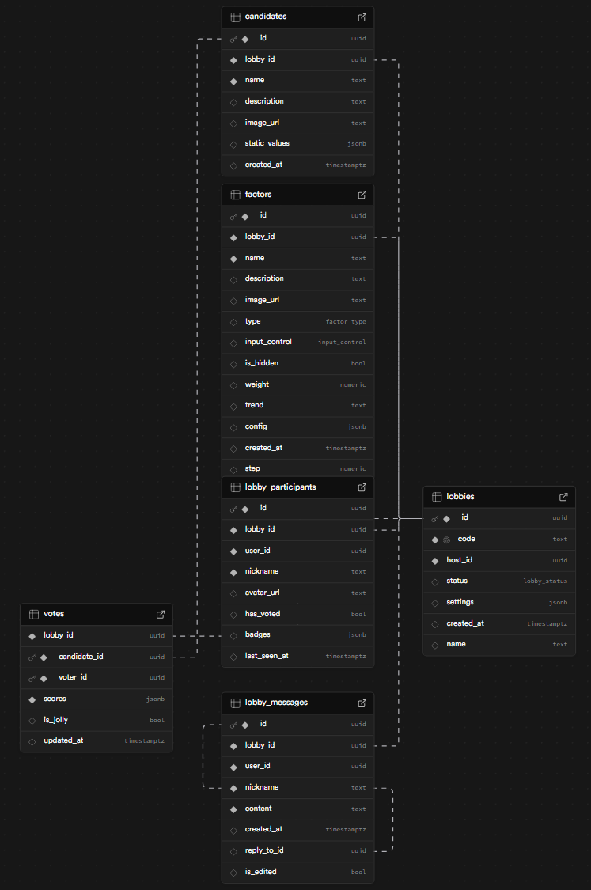

# 🗳️ Democracy is Dead

**Democracy is Dead** is a super duper high-speed, interactive voting experiment built for one purpose: to have fun with friends ranking frozen pizzas. 

This project is a pure **vibecoding** experiment. It was built almost entirely through natural language interaction with **Gemini** and **Google AI Studio**, focusing on doing messy and shitty code.



## 🎯 The Mission: Ethical & Effective Decision Making
The core philosophy of this project was to move beyond the "Plurality" system (where the most votes win, often ignoring the preferences of the minority). The goal was to implement and study **Social Choice Theory** through algorithms that are mathematically and ethically more effective at representing collective will.

One of the main goals was to dive deep into these systems and implement them with maximum efficiency.

To be completely honest: the original plan was to implement these algorithms in **C++** (or ultra-optimized Assembly-style TypeScript) to achieve maximum computational efficiency for massive datasets. However, **I lost the will to live** halfway through that rabbit hole. 

Instead of over-engineering a calculator for the next 10 years, I decided to focus on "vibecoding" a functional, fast, and fun tool for me and my friends. 

#### Current Implementations:
* **The Schulze Method (Beatpath):**
    * **The Logic:** Simulates 1-on-1 "duels" between every candidate pair based on user rankings.
    * **The Math:** Uses the **Floyd-Warshall algorithm** to find the "strongest path" of victories.
    * **Ethical Advantage:** Immune to the "spoiler effect" and ensures the winner is the candidate who minimizes overall dissatisfaction.
* **Weighted Sum Model (MCDA):**
    * **The Logic:** Voters rate candidates based on specific **factors** (Price, Quality, etc.).
    * **The Math:** Sums normalized scores multiplied by **factor weights**, handling "Lower-is-Better" trends and "Null Factors".
* **Z-Score Normalization:**
    * **The Logic:** Calculates standard deviations to identify how much a vote differs from the group mean.
    * **Ethical Advantage:** Helps keep the results honest by highlighting extreme outliers or biased "troll" votes.

## ✨ Features
* **Instant Lobbies:** Create a room, share a code, and start the process.
* **Dynamic Factor Voting:** Rate candidates based on customizable factors.
* **Real-time Interaction:** Powered by Supabase Realtime for live updates and chat.
* **Advanced Analytics:** View results via Schulze method matrices, radar charts, and podiums.
* **AI-Assisted Core:** Developed using Google AI Studio to streamline complex logic.

## 📸 Gallery

| Setup & Config | Voting Interface |
|:---:|:---:|
|  |  |

| Results & Ranks | Database Layer |
|:---:|:---:|
|  |  |

## 🛠️ Tech Stack
* **Language:** TypeScript
* **Framework:** Next.js (App Router)
* **Backend & DB:** [Supabase](https://supabase.com/) (PostgreSQL + Realtime)
* **AI Tooling:** [Google AI Studio](https://aistudio.google.com/) (Gemini 1.5 Pro)
* **Hosting:** [Vercel](https://vercel.com/)

---

## 🏃 Getting Started (Local Setup)

To get this project running locally, you must set up your own instances of the required services. **For security reasons, my personal credentials and API keys are included in a `.env.local` file which is ignored by Git.**

### 1. Prerequisites
You will need to create your own free accounts on:
* [Supabase](https://supabase.com/) (For the database and authentication)
* [Vercel](https://vercel.com/) (If you wish to deploy it)

### 2. Environment Variables & Security

**Crucial:** For security reasons, my personal credentials, API keys, and database secrets are stored in a `.env.local` file which is included in the `.gitignore`. They are not available in this repository.

To run this project, you must manually create a `.env.local` file in the root folder of your local directory.

1.  **Create the file:**
    ```bash
    touch .env.local
    ```
2.  **Add your credentials:**
    Log in to your [Supabase Dashboard](https://app.supabase.com/), create a new project, and copy your specific API keys into the file as follows:

    ```env
    # Your Supabase Project URL
    NEXT_PUBLIC_SUPABASE_URL=[https://your-project-id.supabase.co](https://your-project-id.supabase.co)

    # Your Supabase Anonymous Key
    NEXT_PUBLIC_SUPABASE_ANON_KEY=your-actual-anon-key-string
    ```

3.  **Why this is necessary:**
    Since this is a "vibecoding" experiment meant for fast deployment on free-tier services, each user needs their own sandbox. By using your own Supabase keys, you ensure that your data, lobbies, and "friends-only" sessions remain under your control and isolated from others.

### 3. Installation & Database Setup
1.  **Install dependencies:**
    ```bash
    npm install
    ```
2.  **Initialize Database:**
    Go to the `db/` folder in this repo. Copy the content of the `.sql` files and run them in your Supabase **SQL Editor**. This will recreate the necessary tables (Lobbies, Candidates, Votes, Messages) and the Row Level Security (RLS) policies required for the app to function.

3.  **Launch:**
    ```bash
    npm run dev
    ```
    The app will now be running on [http://localhost:3000](http://localhost:3000) using your own private backend.

---
*Remember: Never commit your `.env.local` file to a public repository!*
---

Created with ❤️, vibes, and a lot of AI prompts.